# Deej System - Visual Flow Diagrams

## Current Implementation Flow

### 1. System Overview

### 2. Detailed Control Flow for AudioPlayer Channels

### 3. Control Path Separation

### 4. Volume Provider State Management

### 5. Mapping Configuration Impact

### 6. Error Scenarios and Recovery

```mermaid
flowchart TD
    START[Audio Playback Requested]

    START --> CHECKMAP{Channel Mapped to Deej?}

    CHECKMAP -->|Yes| CHECKCONN{Deej Connected?}
    CHECKMAP -->|No| DIRECTVOL[Use UI Volume]

    CHECKCONN -->|Yes| GETPROV[Get Provider Volume]
    CHECKCONN -->|No| DIRECTVOL

    GETPROV --> CHECKVOL{Provider Volume > 0?}

    CHECKVOL -->|Yes| USEPROV[Use Provider Volume]
    CHECKVOL -->|No| FALLBACK[Use Fallback 0.7]

    USEPROV --> SETVOLUME[Set AudioPlayer Volume]
    FALLBACK --> SETVOLUME
    DIRECTVOL --> SETVOLUME

    SETVOLUME --> PLAY[Play Audio]

    PLAY --> SUCCESS{Audio Audible?}
    SUCCESS -->|Yes| END[✓ Success]
    SUCCESS -->|No| DEBUG[Check Debug Logs]
```

## Key Points

1. **Separation of Concerns**: Windows audio and AudioPlayer channels are handled differently
2. **Provider-Driven**: AudioPlayer volumes are driven by provider state when Deej is connected
3. **Fallback Logic**: System gracefully handles edge cases like zero volumes and disconnection
4. **Conflict Prevention**: VolumeControlServiceV2 prevents UI and Deej from fighting over control
5. **Configuration Flexibility**: Any Deej slider can control any audio target through DeejTarget mappings
6. **Type Safety**: Modern configuration uses enums instead of magic numbers
7. **Service Evolution**: VolumeControlServiceV2 replaces the legacy integer-based mapping system

## Implementation Notes

- **Current Service**: Uses `VolumeControlServiceV2` with `DeejTarget` enum
- **Legacy Support**: Old `SliderMapping` system still available but deprecated
- **AudioPlayer Integration**: Channels respect Deej mappings and provider values
- **Volume Timing**: AudioPlayer volumes applied at playback start, not slider movement
- **Fallback Strategy**: When Deej disconnected, AudioPlayer uses maximum volume

_Contains AI-generated edits._
