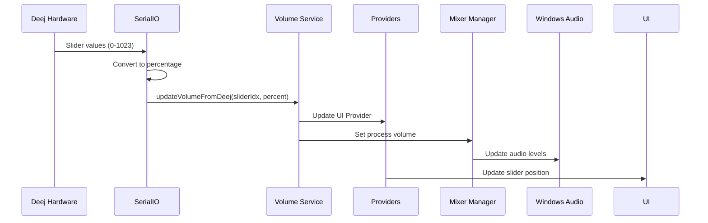
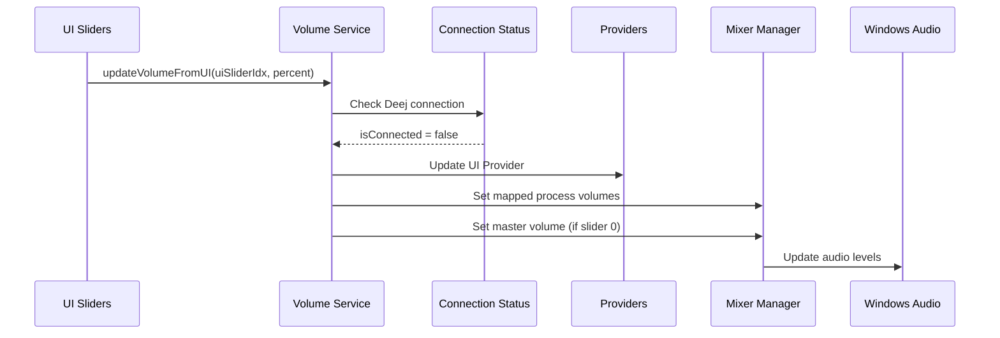

# Volume Control Architecture

## System Overview

This document visualizes the volume control architecture that allows both analog hardware control (via Deej) and UI slider control of Windows audio processes.

## Architecture Diagram

```mermaid
graph TB
    %% External Hardware
    subgraph "Hardware Layer"
        DEEJ[🎛️ Deej Analog Board<br/>4 Physical Sliders]
        SERIAL[📡 Serial Connection]
    end

    %% Connection Status
    subgraph "Connection Management"
        CONN_STATUS[🔌 Deej Connection Status<br/>Provider]
        SERIAL_MGR[📊 Serial Port Manager]
    end

    %% Core Services
    subgraph "Core Services"
        VOLUME_SVC[⚙️ Volume Control Service<br/>Central Logic]
        MIXER_MGR[🎵 Mixer Manager<br/>Windows Audio API]
    end

    %% UI Layer
    subgraph "UI Layer"
        UI_MASTER[🎚️ Master Slider<br/>UI Slider 0]
        UI_P1[🎚️ P1 Slider<br/>UI Slider 1]
        UI_P2[🎚️ P2 Slider<br/>UI Slider 2]
        UI_P3[🎚️ P3 Slider<br/>UI Slider 3]
    end

    %% State Management
    subgraph "Riverpod Providers"
        MAIN_VOL[📊 Main Volume Provider]
        P1_VOL[📊 P1 Volume Provider]
        P2_VOL[📊 P2 Volume Provider]
        P3_VOL[📊 P3 Volume Provider]
    end

    %% Windows Audio
    subgraph "Windows Audio System"
        WIN_MASTER[🔊 Master Volume]
        WIN_CHROME[🌐 Chrome Process]
        WIN_DISCORD[💬 Discord Process]
        WIN_SPOTIFY[🎵 Spotify Process]
        WIN_OTHER[📱 Other Processes]
    end

    %% Configuration
    subgraph "Configuration"
        MAPPINGS[📋 Slider Mappings<br/>Settings]
    end

    %% Connections - Hardware Path
    DEEJ --> SERIAL
    SERIAL --> SERIAL_MGR
    SERIAL_MGR --> CONN_STATUS
    SERIAL_MGR --> VOLUME_SVC

    %% Connections - UI Path
    UI_MASTER --> VOLUME_SVC
    UI_P1 --> VOLUME_SVC
    UI_P2 --> VOLUME_SVC
    UI_P3 --> VOLUME_SVC

    %% Connections - Core Logic
    VOLUME_SVC --> MAIN_VOL
    VOLUME_SVC --> P1_VOL
    VOLUME_SVC --> P2_VOL
    VOLUME_SVC --> P3_VOL
    VOLUME_SVC --> MIXER_MGR
    CONN_STATUS --> VOLUME_SVC
    MAPPINGS --> VOLUME_SVC

    %% Connections - Audio Output
    MIXER_MGR --> WIN_MASTER
    MIXER_MGR --> WIN_CHROME
    MIXER_MGR --> WIN_DISCORD
    MIXER_MGR --> WIN_SPOTIFY
    MIXER_MGR --> WIN_OTHER

    %% Connections - UI Updates
    MAIN_VOL --> UI_MASTER
    P1_VOL --> UI_P1
    P2_VOL --> UI_P2
    P3_VOL --> UI_P3

    %% Styling
    classDef hardware fill:#ff9999,stroke:#ff0000,stroke-width:2px
    classDef ui fill:#99ccff,stroke:#0066cc,stroke-width:2px
    classDef service fill:#99ff99,stroke:#00cc00,stroke-width:2px
    classDef provider fill:#ffcc99,stroke:#ff6600,stroke-width:2px
    classDef windows fill:#cc99ff,stroke:#6600cc,stroke-width:2px
    classDef config fill:#ffff99,stroke:#cccc00,stroke-width:2px

    class DEEJ,SERIAL hardware
    class UI_MASTER,UI_P1,UI_P2,UI_P3 ui
    class VOLUME_SVC,MIXER_MGR,SERIAL_MGR service
    class MAIN_VOL,P1_VOL,P2_VOL,P3_VOL,CONN_STATUS provider
    class WIN_MASTER,WIN_CHROME,WIN_DISCORD,WIN_SPOTIFY,WIN_OTHER windows
    class MAPPINGS config
```



## Flow Diagrams

### When Deej is Connected



### When Deej is Disconnected



## Component Details

### Volume Control Service

- **Purpose**: Central coordination of volume updates
- **Key Methods**:
  - `updateVolumeFromDeej()` - Handles hardware input
  - `updateVolumeFromUI()` - Handles UI slider input
- **Logic**: Checks connection status to determine action scope

### Slider Mappings Configuration

```
UI Slider 0 (Master) → Windows Master Volume + Mapped Processes
UI Slider 1 (P1)     → Mapped Processes (e.g., Chrome)
UI Slider 2 (P2)     → Mapped Processes (e.g., Discord)
UI Slider 3 (P3)     → Mapped Processes (e.g., Spotify)
```

### Connection States

#### Deej Connected ✅

- Hardware sliders control everything
- UI sliders reflect hardware position
- SerialIO manages the communication

#### Deej Disconnected ❌

- UI sliders become active controls
- Direct system volume control enabled
- Hardware sliders have no effect

## File Structure

```
lib/
├── core/
│   ├── providers/
│   │   ├── deej_providers.dart          # Connection status
│   │   └── volume_providers.dart        # Volume state
│   └── services/
│       └── volume_control_service.dart  # Central logic
├── features/
│   ├── screen_home/
│   │   ├── application/
│   │   │   ├── deej_processor/
│   │   │   │   └── class_serial_IO.dart # Hardware interface
│   │   │   └── mixer_manager/
│   │   │       └── mixer_manager.dart   # Windows Audio API
│   │   └── presentation/
│   │       └── volume/
│   │           └── classes/
│   │               └── class_column_volume.dart # UI sliders
│   └── screen_settings/
│       ├── data/
│       │   └── class_slider_mappings.dart       # Configuration model
│       └── presentation/
│           └── widgets/
│               └── widget_settings_deej_mappings.dart # Settings UI
```

## Benefits

1. **Seamless Transition**: No manual switching required
2. **Fallback Control**: UI always available when hardware fails
3. **Flexible Mapping**: Configure any process to any slider
4. **Minimal Code Changes**: Leverages existing architecture
5. **Type Safety**: Full Riverpod provider system integration

## Usage Examples

### Setting Up Process Mappings

1. Go to Settings → Deej Mappings
2. Add process names (e.g., "chrome", "discord")
3. Map Deej sliders to UI sliders and processes
4. Changes take effect immediately

### Behavior Examples

- **Hardware connected**: Move Deej slider 1 → Chrome volume changes, UI slider 1 moves
- **Hardware disconnected**: Move UI slider 1 → Chrome volume changes directly
- **Master slider**: Always controls Windows master volume when Deej disconnected

## Master Volume Handling Update

### Issue Fixed

The system was previously trying to find a running process named "master" instead of directly updating the Windows master volume when:

1. UI slider index is 0 (Master slider)
2. Process mapping name is "master"

### Solution

Updated `_updateProcessVolume()` method to check for special case:

```dart
// Special handling for master volume
if (processName.toLowerCase() == 'master') {
  await _updateMasterVolume(volumePercent);
  return;
}
```

### Updated Flow

```mermaid
flowchart TD
    PROCESS_UPDATE[_updateProcessVolume called] --> CHECK_MASTER{processName == 'master'?}

    CHECK_MASTER -->|Yes| DIRECT_MASTER[Update Windows Master Volume<br/>_updateMasterVolume()]
    DIRECT_MASTER --> LOG_MASTER[Log master volume update]
    LOG_MASTER --> END_MASTER[Complete]

    CHECK_MASTER -->|No| FIND_PROCESSES[Find matching processes<br/>in mixer list]
    FIND_PROCESSES --> UPDATE_PROCESSES[Update all matching<br/>process volumes]
    UPDATE_PROCESSES --> END_PROCESSES[Complete]

    %% Styling
    classDef special fill:#e8f5e8,stroke:#2e7d32,stroke-width:2px
    classDef normal fill:#e3f2fd,stroke:#1976d2,stroke-width:2px
    classDef decision fill:#fff3e0,stroke:#e65100,stroke-width:2px

    class DIRECT_MASTER,LOG_MASTER special
    class FIND_PROCESSES,UPDATE_PROCESSES normal
    class CHECK_MASTER decision
```

### Benefits

- ✅ **Immediate master volume control** without process lookup
- ✅ **Works for both UI and hardware inputs** (Deej)
- ✅ **Eliminates "No running processes found matching master" messages**
- ✅ **Maintains backward compatibility** for other process mappings

// Contains AI-generated edits.
