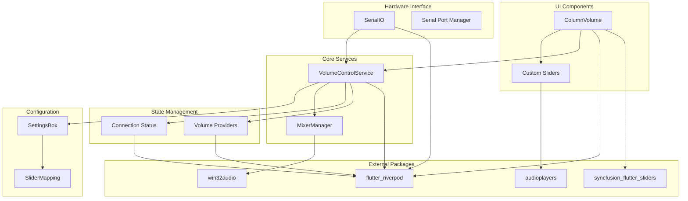
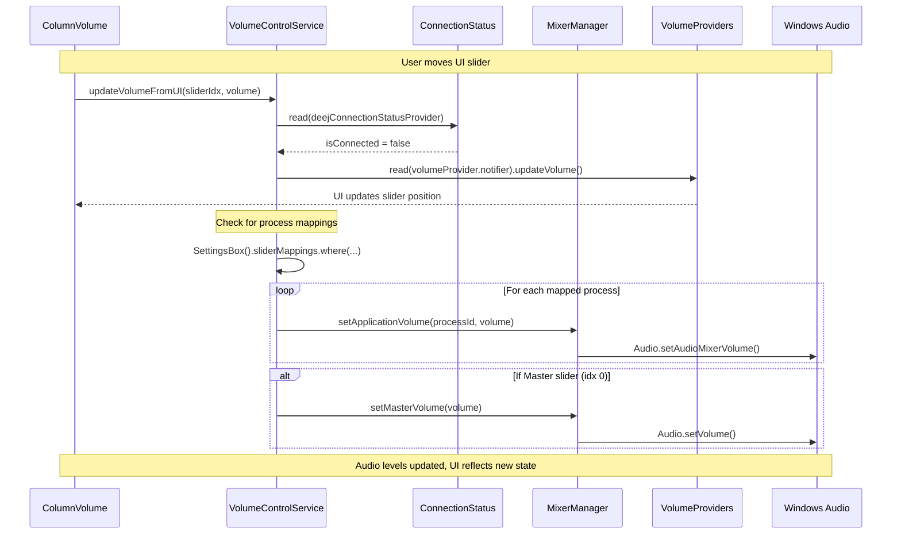

# Volume Control Code Structure

## Class Diagram

```mermaid
classDiagram
    class ColumnVolume {
        -VolumeControlService _volumeControlService
        -Logger logger
        -Timer? _refreshTimer
        -Map<String, Timer> _debounceTimers
        +initState()
        +build(BuildContext context)
        +_buildVolumeColumn()
        +_buildCustomSlider()
    }

    class VolumeControlService {
        -Logger logger
        -MixerManager _mixerManager
        -Ref _ref
        +updateVolumeFromDeej(int, double)
        +updateVolumeFromUI(int, double)
        -_updateUISlider(int, double)
        -_updateProcessVolume(String, double)
        -_updateMasterVolume(double)
        +initialize()
    }

    class MixerManager {
        -List<ProcessVolume> _processes
        -List<AudioDevice> _devices
        +initialize()
        +getMixerList()
        +setApplicationVolume(int, double)
        +setMasterVolume(double)
        +getAudioDevices()
    }

    class SerialIO {
        -DeejConfig config
        -Ref ref
        -MixerManager _mixerManager
        -VolumeControlService _volumeControlService
        +handleLine(String line)
        -_updateVolume(int, double)
    }

    class DeejConnectionStatusProvider {
        <<Provider>>
        +isConnected: bool
    }

    class VolumeProviders {
        <<StateNotifierProvider>>
        +mainVolumeProvider
        +p1VolumeProvider
        +p2VolumeProvider
        +p3VolumeProvider
    }

    class SliderMapping {
        +int deejSliderIdx
        +String processName
        +int uiSliderIdx
        +toJson()
        +fromJson()
    }

    class SettingsBox {
        +List<SliderMapping> sliderMappings
        +addSliderMapping(SliderMapping)
        +removeSliderMapping(int)
        +getMappingForDeejSlider(int)
    }

    %% Relationships
    ColumnVolume --> VolumeControlService : uses
    ColumnVolume --> VolumeProviders : watches
    SerialIO --> VolumeControlService : uses
    VolumeControlService --> MixerManager : uses
    VolumeControlService --> DeejConnectionStatusProvider : reads
    VolumeControlService --> VolumeProviders : updates
    VolumeControlService --> SettingsBox : reads mappings
    SettingsBox --> SliderMapping : contains
    SerialIO --> DeejConnectionStatusProvider : updates status

    %% Styling
    classDef widget fill:#e3f2fd,stroke:#1976d2,stroke-width:2px
    classDef service fill:#e8f5e8,stroke:#388e3c,stroke-width:2px
    classDef provider fill:#fff3e0,stroke:#f57c00,stroke-width:2px
    classDef data fill:#fce4ec,stroke:#c2185b,stroke-width:2px

    class ColumnVolume widget
    class VolumeControlService,MixerManager,SerialIO service
    class DeejConnectionStatusProvider,VolumeProviders provider
    class SliderMapping,SettingsBox data
```

## Package Dependencies



## Method Call Flow



## File Organization

```
lib/
├── features/screen_home/presentation/volume/classes/
│   └── class_column_volume.dart                 # 🎚️ UI Sliders (Modified)
│
├── core/
│   ├── services/
│   │   └── volume_control_service.dart          # ⚙️ Central Logic (Existing)
│   └── providers/
│       ├── volume_providers.dart                # 📊 State Management (Existing)
│       └── deej_providers.dart                  # 🔌 Connection Status (Existing)
│
├── features/screen_home/application/
│   ├── deej_processor/
│   │   └── class_serial_IO.dart                 # 📡 Hardware Interface (Unchanged)
│   └── mixer_manager/
│       └── mixer_manager.dart                   # 🎵 Windows Audio (Existing)
│
├── features/screen_settings/
│   ├── data/
│   │   └── class_slider_mappings.dart           # 📋 Configuration Model (Existing)
│   └── presentation/widgets/
│       └── widget_settings_deej_mappings.dart   # ⚙️ Settings UI (Existing)
│
└── core/
    └── properties.dart                          # 💾 Persistent Storage (Existing)
```

## Key Implementation Points

### 1. Connection-Aware Volume Control

```dart
// In VolumeControlService.updateVolumeFromUI()
final isDeejConnected = _ref.read(deejConnectionStatusProvider);

// Always update UI
await _updateUISlider(uiSliderIdx, volumePercent);

// Only control system audio if Deej is disconnected
if (!isDeejConnected) {
  await _updateMasterVolume(volumePercent); // Master slider
  await _updateProcessVolume(processName, volumePercent); // Mapped processes
}
```

### 2. UI Slider Integration

```dart
// In ColumnVolume._buildVolumeColumn()
(value) {
  // Changed from direct provider update to service call
  _volumeControlService.updateVolumeFromUI(sliderIndex, value / 100);
}
```

### 3. Minimal Hardware Changes

```dart
// SerialIO remains unchanged - already uses VolumeControlService
void _updateVolume(int sliderIdx, double percent) {
  // Existing logic preserved
  _volumeControlService.updateVolumeFromDeej(sliderIdx, percent);
}
```

## Data Flow Summary

| Scenario              | Input Source    | Path                                               | Output                    |
| --------------------- | --------------- | -------------------------------------------------- | ------------------------- |
| **Deej Connected**    | Hardware Slider | SerialIO → VolumeService → Providers + Audio       | UI updates + System audio |
| **Deej Disconnected** | UI Slider       | UI → VolumeService → Providers + Audio             | UI updates + System audio |
| **Connection Lost**   | System Event    | SerialManager → ConnectionProvider → VolumeService | Mode switch               |
| **Settings Change**   | User Config     | SettingsUI → SettingsBox → VolumeService           | Mapping update            |

This visualization shows how the implementation provides seamless control regardless of hardware connection status, with minimal code changes and maximum reuse of existing architecture.
