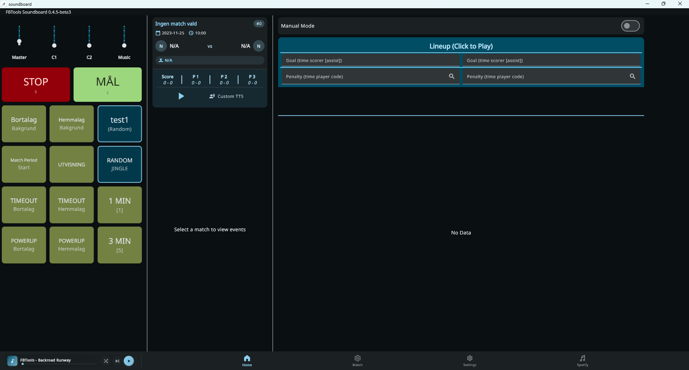
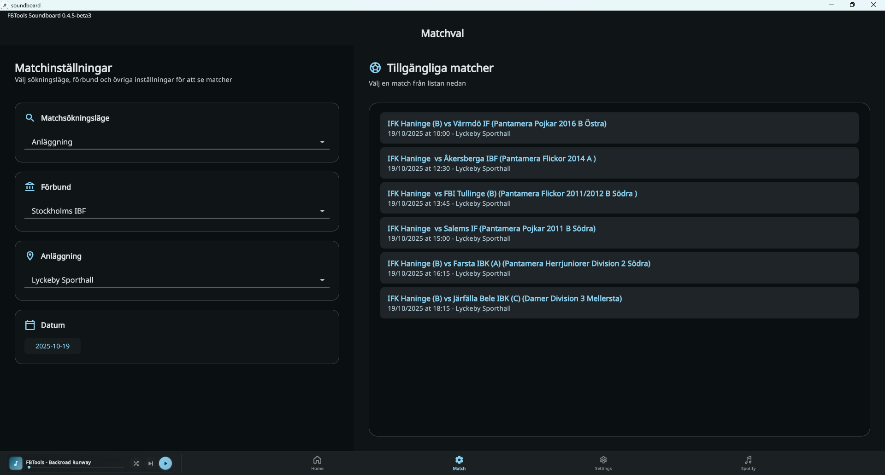
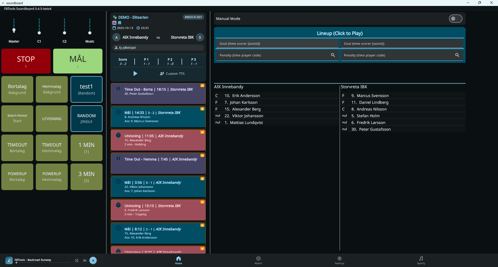
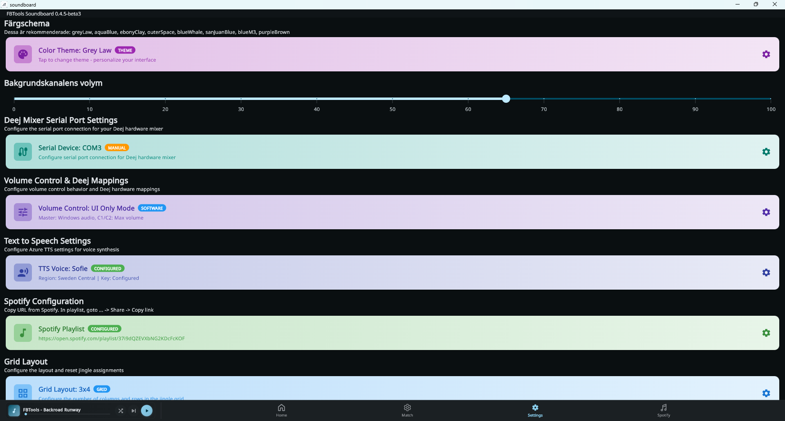

# Screenshots

This document showcases the main screens of the Soundboard application.

## Home Screen

The home screen provides quick access to sound effects and main features of the application.

## Match Screen

The match screen shows the matches in your arena on a specific day. Choose the match you want to view and see the results on the main screen.

## Events Screen

The events screen shows the events in the match that is entered into ibis. The play button starts a live polling session when the match is live.

## Settings Screen

The settings screen provides configuration options for the application, including audio settings and preferences.
